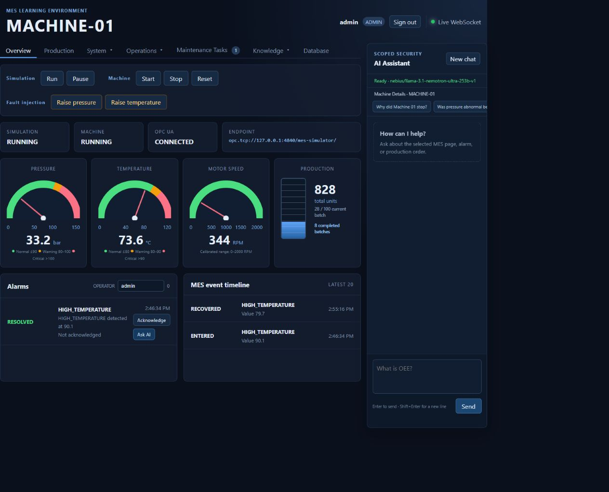

# MES AI Assistant

A local MES factory simulation that demonstrates how machine data can flow through industrial communication, persistence, monitoring, and a governed AI assistant.



## Included components

- Machine and PLC simulation
- OPC UA and MQTT communication
- SQL Server persistence
- FastAPI dashboard with live WebSocket updates
- Alarm, maintenance, production, and OEE workflows
- Role-based access and an OpenAI-compatible assistant
- Retrieval-augmented generation (RAG) and ontology search

## Quick start

Requirements: Docker Desktop with Docker Compose.

```powershell
git clone https://github.com/AIAOnet/mes-ai-assistant.git
cd mes-ai-assistant
Copy-Item .env.example .env
docker compose up -d --build
```

On macOS or Linux, replace the copy command with:

```bash
cp .env.example .env
```

### Configure `.env`

The values copied from `.env.example` are simulation-only defaults, so no
changes are required to run the project locally. To enable the AI assistant,
open `.env` and set these values for your OpenAI-compatible provider:

```dotenv
MES_AI_API_ENDPOINT=https://your-provider.example/v1/chat/completions
MES_AI_API_KEY=your-api-key
MES_AI_MODEL=your-model-name
```

To enable semantic RAG and ontology search, also configure an embeddings model:

```dotenv
MES_RAG_EMBEDDING_ENDPOINT=https://your-provider.example/v1/embeddings
MES_RAG_EMBEDDING_API_KEY=your-api-key
MES_RAG_EMBEDDING_MODEL=your-embedding-model-name
```

`MES_RAG_EMBEDDING_API_KEY` may be left blank when the embedding service uses
the same key as `MES_AI_API_KEY`. If all embedding settings are left blank, the
knowledge base still works using keyword search. If the dashboard will be
accessible from any other computer, replace all demo passwords and
`MES_DASHBOARD_SECRET` before changing `MES_BIND_ADDRESS` from `127.0.0.1`.

Open [http://127.0.0.1:8000](http://127.0.0.1:8000) after the containers become healthy.

The included credentials are simulation-only defaults. Keep the application bound to localhost unless you replace them.

## Sign in

Use the default administrator account from `.env.example`:

```text
Username: admin
Password: Admin-Demo-2026!
```

Additional operator, maintenance, engineer, manager, and viewer accounts are
defined in `.env`. These accounts are for the local simulation only.

## Try the RAG demo

The repository includes
[`RAG_Demo_Machine_01_High_Pressure_Procedure.md`](RAG_Demo_Machine_01_High_Pressure_Procedure.md)
as demonstration content for testing document retrieval and ontology search.

Sign in as an administrator, open **Knowledge → RAG**, and upload the file with
the following metadata:

- Title: `Machine 01 High-Pressure Response Procedure`
- Version: `1.0`
- Machine: `MACHINE-01`
- Alarm type: `HIGH_PRESSURE`
- Assistant access: select the roles that may retrieve the procedure

Select **Upload & index**, then test retrieval with questions such as:

- What should I do when hydraulic pressure is too high?
- When can Machine 01 be restarted?
- How should stored hydraulic energy be handled during maintenance?

Keyword retrieval works without an embedding provider. When the embedding
settings in `.env` are configured, new uploads are also indexed for semantic
search. Use **Reindex vectors** to add embeddings to documents that were
uploaded before the embedding provider was configured.

### Create ontology triples

The upload metadata automatically creates relationships from `MACHINE-01` and
`ALARM-TYPE:HIGH_PRESSURE` to the uploaded procedure. Manual triples are
optional and can describe additional domain relationships.

Open **Knowledge → Ontology** as an administrator. A triple has the form
`subject → predicate → object`. Add these example triples one at a time:

| Subject | Predicate | Object |
| --- | --- | --- |
| `MACHINE-01` | `HAS_COMPONENT` | `HYDRAULIC-CIRCUIT-01` |
| `PRESSURE-SENSOR-01` | `MONITORS` | `HYDRAULIC-CIRCUIT-01` |
| `ALARM-TYPE:HIGH_PRESSURE` | `AFFECTS` | `HYDRAULIC-CIRCUIT-01` |

Entity identifiers may contain letters, numbers, `.`, `:`, `_`, and `-`.
Predicates are stored in uppercase with underscores. After adding the triples,
search for `everything related to the pressure problem on Machine 01` and use a
depth of two hops to inspect the connected graph.

## Verify the installation

```powershell
docker compose ps
```

The SQL Server, MQTT broker, and dashboard services should report as healthy. OPC UA and MQTT certificates and the broker password file are generated automatically in Docker volumes during first startup.

## Manage the containers

Follow the dashboard logs:

```powershell
docker compose logs -f dashboard
```

Stop the project without deleting its data:

```powershell
docker compose down
```

After changing `.env` or application files, rebuild and restart:

```powershell
docker compose up -d --build
```

To completely reset the simulation:

```powershell
docker compose down -v
docker compose up -d --build
```

> **Warning:** `docker compose down -v` permanently deletes the simulated SQL
> data, indexed knowledge, generated certificates, and MQTT credentials stored
> in Docker volumes.

For deployment and security checks, see
[Production readiness](PRODUCTION_READINESS.md). Additional development
documentation is maintained locally and is not included in the repository.

## Run the tests

The local test environment is optional for users who only want to run the Docker simulation.

Windows PowerShell:

```powershell
python -m venv .venv
.\.venv\Scripts\python.exe -m pip install -r requirements.txt
.\.venv\Scripts\python.exe -m unittest discover -s tests -v
```

macOS or Linux:

```bash
python3 -m venv .venv
.venv/bin/python -m pip install -r requirements.txt
.venv/bin/python -m unittest discover -s tests -v
```

## License

This project is available under the
[PolyForm Noncommercial License 1.0.0](LICENSE.md). You may use, modify, and
distribute it for permitted non-commercial purposes. Commercial use is not
permitted without a separate license from the repository owner.
