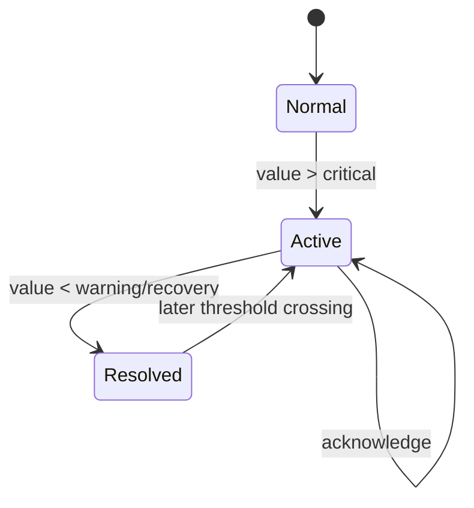
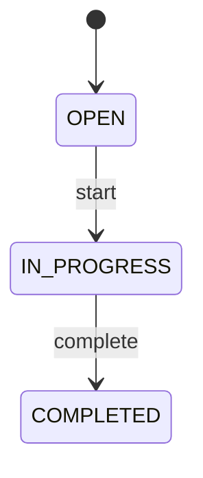

# Alarm and event lifecycle

## State model

Rules exist for `Machine01.Pressure` (`HIGH_PRESSURE`) and
`Machine01.Temperature` (`HIGH_TEMPERATURE`). Comparison is strict: equality
does not enter or recover a condition. Rule state prevents duplicate events
while a condition remains active.

## Lifecycle

1. Every received tag reading is cached and, when persistence is enabled,
   written to `MachineReadings`.
2. A supported numeric tag crossing above `critical` creates one
   `CONDITION_ENTERED` event.
3. The event creates a `HIGH` severity alarm with an ID shaped like
   `A-` plus 12 uppercase hexadecimal characters.
4. The alarm creates one high-priority maintenance task: hydraulic pressure
   inspection or cooling-system inspection.
5. Acknowledgement sets `acknowledged`, operator and time. It does not change
   `ACTIVE` to `RESOLVED`.
6. Falling strictly below the configured warning value emits
   `CONDITION_RECOVERED` and resolves the newest matching active alarm.

## Maintenance task lifecycle

Starting or completing a task in another state leaves its state unchanged.
Task IDs are process-local sequential integers. Alarm identifiers are UUID-based
to avoid restart collisions.

## Persistence and audit

Events, alarms and tasks are persisted through `SQLServerRepository`. Alarm
status changes are captured in `AlarmAudit` by database behavior. Authenticated
HTTP write actions are recorded in `OperatorActionAudit` when dashboard audit is
enabled. Persistence failures and process restarts do not create a documented
replay/reconciliation mechanism; that is a site-specific production gap.
