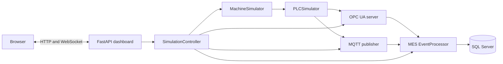

# Architecture

## System context

`SimulationController` is the application coordinator. It owns the simulated
machine, PLC, both transports, MES processor, production-order state and the
simulation loop. `dashboard.api` supplies validation, authentication,
authorization, audit logging, HTTP endpoints and `/ws/live`.

## Layers and ownership

- `machine`: physical-state simulation and the PLC tag snapshot.
- `opc`: OPC UA server and a standalone demonstration client.
- `mqtt`: certificate generation; broker configuration is under `mqtt/`.
- `mes`: transport clients, threshold rules, events, alarms, maintenance tasks,
  production orders and the persistence port.
- `database`: idempotent SQL bootstrap and `SQLServerRepository`.
- `dashboard`: controller, API, static UI, authentication, logs and monitoring.
- `scripts`: backup, guarded restore, recovery drill and readiness audit.

## Runtime topology

Docker Compose starts SQL Server and Mosquitto, waits for health, runs the
idempotent database initializer, then starts the dashboard. SQL data is stored
in the `mes-sql-data` named volume. Configuration and certificates are mounted
into the dashboard. Published ports default to host loopback.

## Processing path

Each running simulation tick changes machine values, scans PLC tags and
publishes them through the selected transport. The MES transport callback calls
`EventProcessor.process`, which caches the latest value, persists the reading,
evaluates stateful rules, creates or resolves an alarm, creates a maintenance
task for a newly supported alarm, and persists the resulting domain objects.

## Persistence

The schema contains `Machines`, `MachineReadings`, `Events`, `Alarms`,
`MaintenanceTasks`, `ProductionOrders`, `ProductionRecords`, `AlarmAudit`, and
`OperatorActionAudit`. The dashboard Database view reads only the latest 50 rows
per dataset through repository queries.

## Operational boundaries

Metrics and recent errors are process memory and reset on dashboard restart.
Machine, alarm, task and order objects are also assembled in memory during the
current process; SQL provides history but is not used to rehydrate all runtime
state. See [Production readiness](../PRODUCTION_READINESS.md) for pilot limits.
